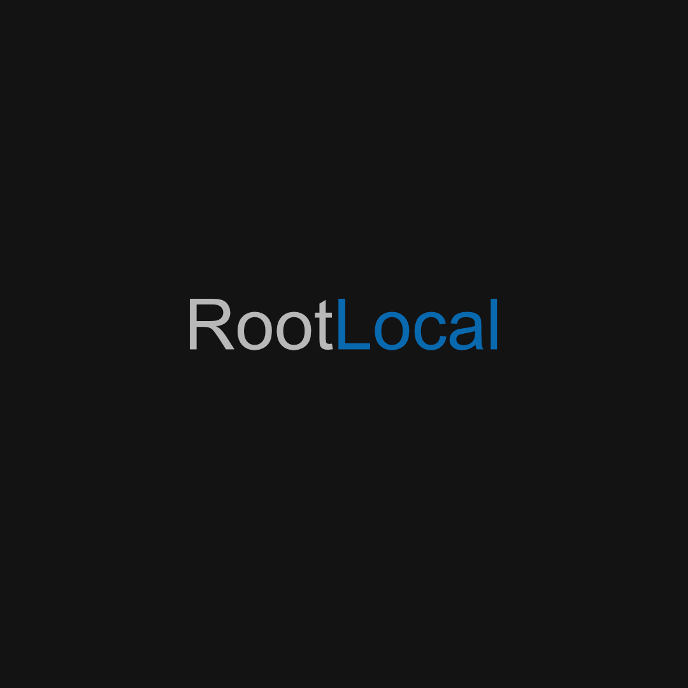

<!-- Profile README for Wannie-1E -->

<h1 align="center">Hi, I'm Wannie 👋</h1>

  <b>Full-Stack Developer | Game Developer | DevOps Enthusiast | Lifelong Learner</b> 
  <i>Building robust apps, beautiful UIs, and interactive games across platforms.</i>

  
  &nbsp;&nbsp;&nbsp;
  
  &nbsp;&nbsp;&nbsp;
  

---

## 🚀 About Me

I'm a passionate and versatile developer with hands-on experience across a wide range of technologies and platforms. My work spans full-stack web development, cross-platform desktop and mobile apps, game development, and DevOps automation.

I enjoy building robust APIs, modern UIs, and interactive games using C#, C++, Godot, .NET (Blazor, MAUI, Avalonia), and web technologies. I thrive in collaborative environments and am always eager to tackle new challenges and contribute to open-source communities.

---

## 🛠️ Tech Stack

  
  
  
  
  
  
  
  
  
  
  
  
  
  
  

---

## 🌟 Featured Projects

### 📦 OpenLMS
A modern, cross-platform **Local Management System** (LMS) built with .NET 8, featuring a complete backend API, web interface, and mobile/desktop applications for managing local resources, users, files, communications, and scheduling within a local network or organization.
- **Tech:** .NET 8, Blazor, MAUI, Avalonia, PostgreSQL, SignalR
- **Features:** User/group management, real-time chat, file management, scheduling, notifications, analytics, video integration

### 💬 LocalShare
A secure, scalable collaboration platform for teams—think Slack, Microsoft Teams, or Discord, but self-hosted and privacy-focused.
- **Tech:** Node.js, Express, TypeScript, React, PostgreSQL, Redis, Docker
- **Features:** Real-time chat, file sharing, event calendar, analytics, offline mode, audit logging, strong security

### 👥 LocalTeamSystem
A modern, self-hosted team collaboration platform providing real-time messaging, file management, group collaboration, calendar/scheduling, analytics, and comprehensive team management features.
- **Tech:** React, Express.js, PostgreSQL, Docker, Kubernetes
- **Features:** JWT auth, group management, real-time messaging, file management, analytics, calendar, notifications

### 🏠 RootLocal
Self-hosted-first software for teams, tinkerers, and local ecosystems. Full control. Cross-platform. Offline-capable.
- **Tech:** .NET 8, Node.js, React, Docker, Kubernetes
- **Philosophy:** Offline-friendly, modular, privacy-respecting, accessible across devices

---

## 🧭 Philosophy

> I believe in building tools that are:
> - **Offline-friendly** and fast
> - **Modular** and hackable
> - **Respectful of user privacy**
> - **Accessible across devices**: desktop, mobile, web
> - **Open source and community-driven**

---

## 📫 Get In Touch

- Email: <contact@rootlocal.dev>
- [More coming soon!]

---

  <i>Thanks for visiting! 🚀</i>

